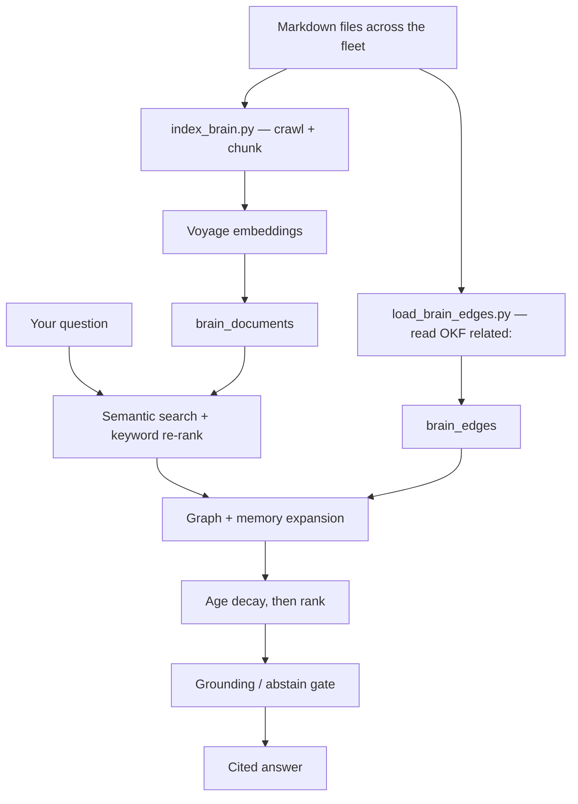

# Brain RAG

The brain RAG layer lets you query the `agentic-portfolio` knowledge base (decisions, projects, career docs, brand notes, business pipeline) using the same `DOCUMENT_QA` workflow that answers questions over any ingested document. It's a personal semantic search over everything written in the company brain.

In the Bastion program, this is the **Python half of the Brain layer** — semantic retrieval over the company-brain corpus. The structural half (graph queries over the OKF `[[link]]` structure) lives in the Console (`bastion`, Rust). See `planning/master-plan.md` → "Bastion Program Blocks" and `planning/decisions/D36-bastion-engine-brain-role.md`.

---

## What this page is for

You want to search the company brain in natural language, or you want to understand why a search
returned what it did. This page covers the whole path: how a markdown file becomes searchable rows,
and how a question becomes a ranked, cited answer.

A **corpus** is one searchable body of text. There are three: `brain` (markdown docs), `code`
(source files), `content` (published writing). Unless you say otherwise you are searching `brain`.

## Quickstart

Typed in a terminal, from the repo root.

```bash
uv run syn refresh                                  # build the corpus + the graph
uv run syn pulse                                    # confirm it has rows and is fresh
uv run syn recall "what did we decide about rates"  # ask it something
uv run syn walk <doc_id> --depth 2                   # follow the structural graph out from a doc
```

| Must exist first | If it does not |
|---|---|
| Postgres running with the `pgvector` extension | Run `scripts/dev-setup.sh`, or see [getting-started.md](getting-started.md). |
| `VOYAGE_API_KEY` set | See [configuration.md](configuration.md); embedding fails without it. |
| A `brain.toml` manifest at the brain root | `index_brain.py` discovers repos from it; without it nothing is crawled. |

Full flag reference for every command above: [scripts.md](scripts.md). One-line summaries of
everything else the repo can do: [capabilities.md](capabilities.md).

## The shape



1. Every markdown file in every `brain.toml` repo is crawled, split into chunks, and embedded into
   `brain_documents`.
2. The OKF `related:` frontmatter of those same files becomes `brain_edges` — the structural graph.
3. A question is answered by searching semantically **and** by keyword, then fusing the two.
4. The results are expanded along the graph and against the memory tier, then re-ranked with a
   penalty for age.
5. Before answering, a gate checks the answer is actually grounded in the retrieved text — if it is
   not, the system abstains rather than guessing.

**You personally do step 1 and 2** by running `syn refresh`. Steps 3–5 happen inside every
`syn recall` and every `DOCUMENT_QA` run.

---

## Architecture

```
agentic-portfolio/ markdown files
         │
  scripts/index_brain.py   ← you run this to index / re-index
         │
  BrainDocument rows       ← pgvector table (one row per section chunk)
         │
  app/brain/retrieval_engine.py   ← the promoted two-stage hybrid pipeline (OR.K2)
  (called by RetrieveChunksNode / DOCUMENT_QA, and by app/brain/retrieval.py / syn recall --hybrid)
         │
  AnswerNode               ← grounded answer from brain context
```

**OR.K2** promoted the retrieval pipeline out of `RetrieveChunksNode` into
`app/brain/retrieval_engine.py::retrieve()` — a module-level function, not a node method — so both
the `DOCUMENT_QA` workflow and `app/brain/retrieval.py` (`syn recall --hybrid` /
`GET /recall?hybrid=true`) share one implementation. `RetrieveChunksNode` is now a ~30-line
`TaskContext` adapter that reads the event and delegates; ranking is byte-identical to before the
promotion. See `docs/api-reference.md` §
[Retrieval Engine](api-reference.md#retrieval-engine-appbrainretrieval_enginepy) for the full
reference.

There are three layers:
- **Layer 1 (shipped):** `BrainDocument` model + `index_brain.py` CLI — index the corpus
- **Layer 2 (shipped):** `app/brain/retrieval_engine.py::retrieve(corpus="brain", ...)` (OR.K2) — query the corpus via `DOCUMENT_QA` (through the `RetrieveChunksNode` adapter) or directly via `syn recall --hybrid` / `GET /recall?hybrid=true`, including a structural graph-expansion stage (`BrainEdge` model + `load_brain_edges.py` CLI, OR.G — see below)
- **Layer 3 (planned — Block R):** Brain-as-MCP-server exposing brain retrieval to external clients (the Python server half of the MCP split; the Console vendors the Rust client). Was scoped as "Project F" before the Bastion reframe; see D36.

The indexer's own roadmap sits in the demand-first program blocks: **Block B** populates the vector store over the brain corpus, **Block O** widens it to every sub-repo's `planning/` + `CLAUDE.md`, and **Block J** makes re-indexing automatic on commit (today it is the manual CLI below).

---

## The `BrainDocument` model

Each row is one section-level chunk of a brain document. The brain is indexed by H2/H3 section header so each chunk has a named section and maps to a coherent unit of content.

| Column | Type | What it holds |
|---|---|---|
| `id` | UUID | Row identifier |
| `file_path` | string | Relative path from brain root (e.g. `docs/career.md`) |
| `doc_type` | string | Corpus category: `decision`, `project`, `career`, `brand`, `business`, `content`, `diagnostic`, `memory` |
| `section` | string | H2/H3 header this chunk falls under |
| `content` | text | Raw chunk text (up to ~500 tokens) — YAML frontmatter block is stripped before storage |
| `embedding` | vector(1024) | Embedding vector — local Ollama `mxbai-embed-large` by default (see `EmbeddingService`), or Voyage `voyage-2` if `EMBEDDING_PROVIDER=voyage` |
| `indexed_at` | datetime | When this chunk was last indexed |
| `client_slug` | string (nullable) | Diagnostic client id — only for `doc_type="diagnostic"` |
| `workflow_patterns` | ARRAY(string) (nullable) | Pattern tags from diagnostic docs |
| `doc_id` | string (nullable) | OKF `id` frontmatter field; falls back to filename stem when absent |
| `layer` | ARRAY(string) (nullable) | OKF `layer` frontmatter field (e.g. `["Brain", "Engine"]`); bare strings coerced to list |
| `project` | string (nullable) | OKF `project` frontmatter field (controlled vocabulary; out-of-vocab values warn but are stored) |
| `status` | string (nullable) | OKF `status` frontmatter field (e.g. `active`, `draft`, `archived`) |
| `keywords` | ARRAY(string) (nullable) | OKF `keywords` frontmatter field; used in GIN-indexed search |
| `related` | ARRAY(string) (nullable) | OKF `related` frontmatter field — `[[wikilink]]` targets for graph traversal |
| `authored_at` | datetime (nullable) | Block OR.M. The file's `mtime` at index time (`file_path.stat().st_mtime`), persisted on upsert and backfillable for pre-existing rows via `--backfill-dates`. Drives the age-decay ranking term below; `NULL` rows are never decayed. |

---

## Indexing the corpus

Run `scripts/index_brain.py` from the repo root:

```bash
# Dry run first — see what would be indexed
python scripts/index_brain.py --dry-run

# First-time index
python scripts/index_brain.py

# After updating brain documents, re-index incrementally
# (skips chunks that are already indexed with the same content)
python scripts/index_brain.py

# Full rebuild — drop all non-diagnostic rows and re-index from scratch
python scripts/index_brain.py --rebuild

# Backfill authored_at (file mtime) on existing rows without re-embedding — a stat() call
# per file, no Ollama round-trip. Run once after upgrading to block OR.M.
python scripts/index_brain.py --backfill-dates
```

**Fresh-clone caveat on `authored_at`.** The indexer stamps `authored_at` from the file's
filesystem `mtime` at index time, which is *checkout* time in a freshly-cloned repo — every file
gets the same clone timestamp, not its true last-edit date. This is not a bug to work around: the
brain vault (`agentic-portfolio`) is edited in place on the machine that runs `index_brain.py`, so
in the actual deployment `mtime` ≈ last-edit time, which is exactly the age signal the ranking
decay (below) wants. A CI runner or a scratch clone would see uniform dates and therefore no
useful decay signal — note it, don't build around it.

The script defaults to the parent of the orchestration repo (the brain root), resolved from the script's own location — so it works from any working directory. If your brain repo is elsewhere:

```bash
python scripts/index_brain.py --brain-path /absolute/path/to/agentic-portfolio
```

**What gets indexed:** see `docs/scripts.md` § index_brain.py for the full corpus list.

**Prerequisites:**
- Postgres running with `brain_documents` table created (`alembic upgrade head`)
- `VOYAGE_API_KEY` set in `app/.env`
- The brain repo exists at the expected path

---

## Querying the brain

### Choosing the corpus

`DOCUMENT_QA` and `app/brain/retrieval.py`'s `recall()`/`hybrid_search()` answer questions over **one of three corpora**, selected by the `corpus` field/parameter. The same two-stage hybrid retrieval serves all three — only the table queried (and its filterable metadata) changes:

| `corpus` value | Table queried | Model | Populated by | What it holds |
|---|---|---|---|---|
| `"content"` *(default)* | `content_chunks` | `ContentChunk` | the `DOCUMENT_INGEST` workflow | documents you ingest at runtime via the API |
| `"brain"` | `brain_documents` | `BrainDocument` | `scripts/index_brain.py` (this page) | the company-brain markdown corpus |
| `"code"` (OR.P) | `code_chunks` | `CodeChunk` | `scripts/index_code.py` (see below) | source-code chunks, per repo/file, split at function/class/method boundaries |

`corpus` is **optional and defaults to `"content"`** on the `DOCUMENT_QA` event payload (and to `"brain"` on `recall()`/`hybrid_search()`/`syn recall`) — so an unqualified call never silently switches corpus. **To query the code corpus you must explicitly pass `corpus="code"`** (`syn recall --corpus code` on the CLI). The `filters` field applies per corpus: `"brain"` accepts `layer`/`project`/`status`; `"code"` accepts `repo`/`language` (below); `"content"` ignores it. (Adding a corpus is a single entry in `app/brain/retrieval_engine.py`'s module-level `_CORPUS_CONFIG` dict.)

### The `code` corpus (OR.P)

Semantic search over the fleet's own source, so the brain can answer "how does X work" or "where is the code that does Y" with a file/line citation — the deterministic twin (exact symbol/definition/references lookup, code-as-graph) is bastion's Block Q and stays Console-side; this is the semantic half only.

- **Chunking** (`app/brain/code_chunking.py`) splits a source file at function/class/method boundaries using tree-sitter. Python and Rust have installed grammars; any other extension — and any file that fails to parse even with a grammar installed — takes a **whole-file fallback**: exactly one chunk spanning the file (`symbol_kind="file"`), so an unsupported or broken file is indexed coarsely rather than dropped silently.
- **Citation shape**: the recall envelope (`{doc_id, file_path, title, section, content, score, via}`) gains **no new field** for this corpus — `OR.3.B` pins that shape field-for-field as the `engine-rs` consumer contract in the same run. A code chunk's citation rides the existing `file_path` (the source path) and `section` (a pre-rendered string, `<symbol_name> (<symbol_kind>, L<start>-<end>)`, populated at index time by the chunker so no caller has to re-derive it); `title` is the symbol name (or the file basename for a fallback chunk); `doc_id` is a stable synthetic `code:<row id>`.
- **Scoping**: `filters={"repo": "<brain.toml slug>"}` (and optionally `"language"`) restricts results to one repo/language — the code corpora are addressable per repo (D47/OR.C), and a query scoped to one repo never returns another repo's chunk.
- **Indexing** — `scripts/index_code.py` crawls each `brain.toml` manifest repo's SOURCE tree (never `docs/`/`planning/` — those are the markdown corpus's), skipping vendored/build directories and any file over 512 KiB:

```bash
# See what would be indexed without calling the embedding backend or writing to the DB
uv run python scripts/index_code.py --dry-run

# Index one repo only
uv run python scripts/index_code.py --repo orchestrator

# Incremental (default): skips a file whose indexed_at is newer than its mtime
uv run python scripts/index_code.py

# Full re-embed of every eligible file
uv run python scripts/index_code.py --rebuild
```

  Rows for files that no longer exist are pruned on every run, incremental or not. There is **no auto-refresh/cron** for the code index yet (that is `OR.J`, deferred on the Mac Mini migration) — re-run it by hand after a source change you want reflected in search.

### Block records (`OR.ticket.index-block-records`)

Each manifest repo's `planning/blocks/*.json` — the block records D65 made the authored home of a
block's `what`/`why`/`out_of_scope`/`acceptance_criteria`/`testing_strategy`/`notes` — is indexed
into the `brain` corpus, one document per record, the same as any markdown file. `_collect_files`
picks these up non-recursively (block records live flat in `planning/blocks/`, not in
subdirectories) alongside the markdown lanes it already walks; `parse_block_record()` reads the
JSON and returns the same `(meta, body)` shape `parse_document()` returns for markdown, so nothing
downstream — chunking, embedding, the mtime-based incremental skip, `--prune-paths` — needs a
branch.

- **`doc_id` scheme**: `block:<repo>:<block-id>`, built from the record's own `repo`/`id` fields
  (never the filename stem, which isn't repo-qualified and can collide across repos). This makes a
  block record **exact-id addressable** the same way a bare decision id already is —
  `syn recall "block:orchestrator:OR.R"` short-circuits straight to that record instead of
  embedding the query.
- **Indexed fields**: `what`, `why`, `out_of_scope`, `acceptance_criteria`, `testing_strategy`,
  `notes` — each rendered under its own `##` markdown heading (`## What`, `## Why`, …) so
  `chunk_by_section` splits a record into multiple retrievable chunks the same way it splits a
  long markdown doc, rather than indexing it as one blob. A field that's absent or empty is
  skipped; its heading never appears.
- **NOT indexed** — machine bookkeeping fields never enter the body or the corpus at all:
  `sdlc_workflow`, `model`, `workflow_rationale`, `spec_dir`, `created`, `updated`,
  `forward_looking`, `depends_on`, `files`. These are process metadata, not prose about the block's
  subject, and embedding them would fill the corpus with noise that matches every planning query
  weakly and nothing strongly.

**Searchable, not walkable.** `mev emit-graph` builds `brain_edges` from markdown OKF frontmatter
and does not crawl JSON, so a block record's own `related`/`depends_on` do **not** become graph
edges from this — `syn walk` will not traverse them. A block record can be found by `syn recall`
(semantic or exact-id) but not reached via structural graph expansion. Making them walkable is a
separate, not-yet-built mev-side change.

**`state.json` is deliberately NOT indexed.** Its `carryover[]`/`reference[]`/`backlog[]` entries
are near-identical, high-churn, short entries that would crowd out real documents in the result
slots on planning-flavoured queries — the corpus already paid for that crowding once (see the
recall@10 regression noted in this ticket's block record). Current-state lookups over those
containers belong to `mev carryover`, not the brain corpus.

### Brain query example

Use `DOCUMENT_QA` with `corpus="brain"`. The `doc_id` field is required by the schema but not used for brain corpus queries — pass any valid UUID:

```bash
curl -X POST http://localhost:8080/events/ \
  -H 'Content-Type: application/json' \
  -H 'X-API-Key: dev-secret' \
  -d '{
    "workflow_type": "DOCUMENT_QA",
    "data": {
      "doc_id": "00000000-0000-0000-0000-000000000000",
      "question": "What is my current contracting rate strategy?",
      "corpus": "brain"
    }
  }'
```

The retrieval runs two-stage hybrid search: HNSW-indexed semantic similarity (Voyage embedding) + a **graded Postgres full-text re-rank**. Section-title (header-only) chunks are **ranking-neutral** — the 2× weight ported from `rag-engine-rs` was measured as a ranking defect and retired by `OR.ticket.section-title-boost` (see `retrieval_engine._SECTION_TITLE_WEIGHT`). Unlike the content corpus (which uses a binary ILIKE keyword match), the brain corpus scores keyword relevance with `ts_rank` over a generated `content_tsv` column: a term in a document's `title` or `keywords` (full-text weight `'A'`) outranks the same term buried in body text (weight `'C'`). `plainto_tsquery` strips English stop words and stems terms natively (`"contracts"` matches `"contract"`), so no manual stop-word list is needed. Returned chunks also carry `file_path`, `doc_id`, and `title` provenance for citation.

By default the brain corpus **excludes archived documents** (`status='archived'`). Pass `"include_archived": true` in the event to surface them (e.g. for historical questions):

```bash
curl -X POST http://localhost:8080/events/ \
  -H 'Content-Type: application/json' \
  -H 'X-API-Key: dev-secret' \
  -d '{
    "workflow_type": "DOCUMENT_QA",
    "data": {
      "doc_id": "00000000-0000-0000-0000-000000000000",
      "question": "When did we do the OKF backfill?",
      "corpus": "brain",
      "include_archived": true
    }
  }'
```

### Structural graph expansion (OR.G)

The brain corpus also supports a **structural** retrieval widening on top of semantic search:
after Stage 1 (semantic) hits are found, the top 5 are used to walk `brain_edges` — a table of
resolved `related:` frontmatter edges, loaded from mev's `emit-graph` output by
`scripts/load_brain_edges.py` — and pull in their neighbor documents as extra candidates before
keyword re-rank. Each structurally-added chunk is flagged `"via": "structural"` in the response
(semantic hits carry `"via": "semantic"`) so callers can distinguish provenance.

This is **on by default** and controlled by the optional `expand_structural` field (default
`true`); set it to `false` to fall back to semantic-only retrieval:

```bash
curl -X POST http://localhost:8080/events/ \
  -H 'Content-Type: application/json' \
  -H 'X-API-Key: dev-secret' \
  -d '{
    "workflow_type": "DOCUMENT_QA",
    "data": {
      "doc_id": "00000000-0000-0000-0000-000000000000",
      "question": "What decisions relate to the Bastion Engine role?",
      "corpus": "brain",
      "expand_structural": false
    }
  }'
```

**Prerequisite:** `brain_edges` must be populated by running mev's `emit-graph` over the brain
repo and piping it into the loader (`mev emit-graph ~/Dev/agentic-portfolio | python
scripts/load_brain_edges.py`) — see `docs/scripts.md` § `load_brain_edges.py`. An edge whose
target doesn't resolve is kept as a dangling row rather than dropped, so structural expansion is
a no-op for that neighbor rather than an error. See `docs/api-reference.md` § `RetrieveChunksNode`
and § `BrainEdge SQLAlchemy Model` for the full mechanics.

**Scoping retrieval with filters** — pass an optional `filters` dict to restrict Stage 1 semantic search to documents matching the specified OKF metadata fields:

```bash
curl -X POST http://localhost:8080/events/ \
  -H 'Content-Type: application/json' \
  -H 'X-API-Key: dev-secret' \
  -d '{
    "workflow_type": "DOCUMENT_QA",
    "data": {
      "doc_id": "00000000-0000-0000-0000-000000000000",
      "question": "What is the current contracting rate strategy?",
      "corpus": "brain",
      "filters": {"project": "orchestrator", "status": "active"}
    }
  }'
```

Supported filter keys: `"layer"` (array overlap — matches if the document's layer list contains the value), `"project"` (scalar `==`), `"status"` (scalar `==`). Unknown keys and `null` values are silently skipped.

### Keyword-candidate expansion

Stage 2's keyword re-rank is scoped to `WHERE id IN (candidate_ids)` — it can only boost a
document Stage 1 (semantic) or Stage 1b (structural) already picked as a candidate. A document
with a strong full-text match but a cosine-distance rank outside the Stage-1 top-20 was
previously invisible to keyword re-rank no matter how well it matched. Confirmed live: the query
`"OR.V graph resolver cleanup"` never surfaced `core/orchestrator/planning/status.md` despite it
having one of the best `ts_rank` scores in the whole corpus, because its cosine-distance rank sat
around 60-77.

Stage 1c (`_keyword_expand`) fixes this: an independent top-15 full-text query (`ts_rank`
descending, same corpus/filters/archived-exclusion as `_semantic_search`) runs alongside
structural expansion, and its hits are unioned into the candidate set before Stage 2 re-ranks,
flagged `"via": "keyword"` in the response. It always runs for the brain corpus (not gated by a
request flag, unlike `expand_structural`) and is a no-op for corpora without a `tsv_field` (e.g.
`"content"`).

### Memory expansion (Stage 1d, OR.M)

`DOCUMENT_QA` can also surface accumulated `SemanticMemory` facts (block OR.S — see
[`docs/memory.md`](memory.md)) as retrieval candidates, flagged `"via": "memory"` alongside
`"semantic"`/`"structural"`/`"keyword"`. This is a fourth candidate source, not a fourth corpus —
it runs on top of whichever corpus the event already queries.

Opt-in, gated on **both** fields together — either alone is a no-op that touches no memory DB:

```bash
curl -X POST http://localhost:8080/events/ \
  -H 'Content-Type: application/json' \
  -H 'X-API-Key: dev-secret' \
  -d '{
    "workflow_type": "DOCUMENT_QA",
    "data": {
      "doc_id": "00000000-0000-0000-0000-000000000000",
      "question": "What is my current contracting rate strategy?",
      "corpus": "brain",
      "workspace_id": "orchestrator",
      "include_memory": true
    }
  }'
```

| Event field | Type | Default | Meaning |
|---|---|---|---|
| `workspace_id` | string, nullable | `null` | D47 workspace name to scope memory retrieval to. Required (non-null) together with `include_memory=true`. |
| `peer_id` | string, nullable | `null` | Optional narrowing of memory retrieval to one entity's facts. |
| `include_memory` | bool | `false` | Opt-in gate for Stage 1d. |
| `apply_decay` | bool | `true` | Opt-out for the `authored_at` age-decay described below (brain corpus only). |

All four fields are optional — a `DOCUMENT_QA` event that omits them validates unchanged and
retrieves exactly as it did before block OR.M (the block's core acceptance criterion: no peers, no
facts, and the response is byte-identical to the pre-OR.M response).

A surfaced memory fact carries `file_path: null` and `doc_id: null` (facts have no source-file
provenance) and its score already reflects the fact's decay — the loader is queried in **cosine
mode** with the same query embedding `RetrieveChunksNode` already computed (not by re-embedding
the question text in NL mode), and the adapter multiplies the raw cosine score by the fact's
`effective_confidence` before merging it into the fused ranking.

Memory is capped at 3 candidates per query and is not diversity-capped by file (every memory
candidate is its own singleton group, `file_path=None`) — see `docs/api-reference.md` §
`RetrieveChunksNode` for the full mechanics, and `docs/memory.md` for the decay/contradiction
model those facts come from.

### Age-based ranking decay (`authored_at`, OR.M)

Independent of memory: brain-corpus candidates are also down-weighted by document age using the
`authored_at` column above. When `apply_decay` is `true` (the default) and a candidate carries a
non-null `authored_at`, its fused score is multiplied by the same decay formula memory facts use
(`confidence * decay_factor ** weeks_elapsed`, from `app/memory/decay.py`), but with a **far
gentler** per-week factor — `0.99`, not memory's `0.95`. At `0.95`/week a 6-month-old row retains
≈26% of its score, which would bury the decisions log for a query like "what did we decide in
June"; at `0.99`/week it retains ≈77%. Rows with `authored_at=null` (not yet backfilled, or from a
corpus that doesn't carry the field) are never decayed. Set `"apply_decay": false` on the event to
reproduce pre-OR.M ranking exactly regardless of `authored_at`.

---

## Testing retrieval manually

Three ways to check that indexing actually produced good, queryable results, from a scored
one-shot signal to the full end-to-end path:

### 0. Scored retrieval quality — `syn eval` (OR.K2)

The only one of these three that produces a **number**, not just a spot-check. Runs the
hand-authored golden set (`planning/retrieval-golden-set.yaml`) through the promoted
`retrieval_engine.retrieve()` pipeline and reports recall@5, recall@10, MRR,
abstain-correctness, and groundedness — deterministic, no LLM anywhere in the scoring:

```bash
syn eval                                                          # score, write a dated report;
                                                                   # compares against the promoted pin by default
syn eval --baseline planning/retrieval-eval-runs/<prior-run>.json # explicit baseline override
syn eval --strict                                                 # old strict-sign tripwire (any decrease)
syn eval --report                                                 # also print a scrubbed, publishable
                                                                   # Markdown report to stdout
syn eval --report path/to/report.md                               # ...or write it to a file
```

Every run also stamps `aggregate_stats` — a 95% interval (Wilson for proportion metrics, seeded
bootstrap for the rest) alongside each metric's point estimate — and, unless `--no-baseline` is
passed, prints a paired per-case verdict (exact sign test / paired bootstrap) against the baseline,
not just a signed delta. See `docs/api-reference.md` §
[Retrieval Eval Harness](api-reference.md#retrieval-eval-harness-appbraineval-syn-eval) for the full
statistical-honesty contract (`plan-eval-statistical-honesty`).

Run `syn stale --deep` first so a drifted index doesn't get measured as a retrieval-quality
regression. This is the method to reach for after any change to `retrieval_engine.py`,
`_fuse_and_rank`, `_CORPUS_CONFIG`, or the golden set itself — (1) and (2) below are for
spot-checking one query at a time. See `docs/api-reference.md` §
[Retrieval Eval Harness](api-reference.md#retrieval-eval-harness-appbraineval-syn-eval).

#### Reading `groundedness` — it is a band, not a target

`groundedness` is a **lexical** content-word overlap of the query against the highest-ranked
chunk of the expected document (`VerifyCitationsNode.support_score`, mirrored). It does not
mean "the answer was correct", and **a healthy corpus does not read ~1.0.** The 2026-08-02
baseline of **0.3608** was decomposed end-to-end by `ticket-groundedness-baseline`
(`planning/artifacts/groundedness-baseline-analysis.md`):

| Term | Share of the deficit from 1.0 | What it is |
|---|---|---|
| Recall coupling (a miss scores 0.0) | ~31% | Read `groundedness_on_hits` instead — 0.5576 |
| First-matching-chunk sampling | ~31% | Scored against the *top-ranked* chunk of the doc, not its best |
| `is_section_title` 2× fusion boost | ~15% | Real ranking defect — **fixed 2026-08-02** by `OR.ticket.section-title-boost` (weight → 1.0) |
| Lexical floor | ~23% | A correct semantic match need not repeat the query's words |

Two of those four terms have since been closed. Admitting the tier `docs/` trees
(`OR.ticket.corpus-tier-docs`) moved the baseline to **0.4637 / 0.5631 on hits**
(`planning/retrieval-eval-runs/2026-08-02T08-02-50Z.json`), and retiring the `is_section_title`
boost (`OR.ticket.section-title-boost`) moved it again to **0.5275 / 0.6405 on hits**
(`2026-08-02T08-19-57Z.json`, the current canonical run) with MRR 0.4917 → 0.5794 and rank-1
header stubs 11/23 → 0/23. What remains is the first-matching-chunk sampling term and the lexical
floor, neither of which is a bug. **Expected healthy range on this golden set is now ~0.50–0.60
overall / ~0.64–0.75 `groundedness_on_hits`; a reading in that band is the documented status quo,
not a regression** — check that artifact before reopening the question. The metric's tokenizer also destroys identifiers
(`D20` → dropped, `OR.K2` → `or`/`k`), so identifier-anchored cases score on very small
denominators; that is a known, deliberately-unfixed fidelity limit, not a bug to re-derive.

### 1. Raw semantic search — `scripts/query_brain.py`

The fastest sanity check. Embeds your query and prints the nearest `brain_documents` rows —
**no** keyword fusion, no structural expansion, no LLM answer. Good for isolating whether
retrieval quality problems are in embedding/ranking versus the fuller pipeline, and for
checking a fresh `--rebuild` without starting the API/Celery stack:

```bash
python scripts/query_brain.py "What is the Bastion program and its five layers?"

# More results, with a content snippet
python scripts/query_brain.py "How does structural graph retrieval work?" --limit 10 --show-content
```

Each line shows cosine distance (`0.0` = identical, larger = less similar), the source file,
its OKF `title`, and the section header. See `docs/scripts.md` § `query_brain.py` for the full
flag reference. Requires only Postgres + Ollama running (no API server, no Celery worker).

The exact-id/semantic/hybrid dispatch this script uses now lives in `app/brain/retrieval.py`
(block OR.N1) — this script is a thin caller over it. The same read core also powers the `syn
recall` console command (`syn recall "..." --json`), and `app/brain/graph.py::walk` / `app/brain/
pulse.py::pulse` add BFS graph traversal and corpus-health checks behind `syn walk` / `syn
pulse`. See `docs/scripts.md` § `syn` and `docs/api-reference.md` §
[Brain Read Core](api-reference.md#brain-read-core-recall--walk--pulse--syn-cli).

A query matching a bare structured code (`D20`, `OR.V`, `MV.3B.Q`) short-circuits straight to
a `doc_id`/`file_path` lookup — no embedding call. Pass `--hybrid` to run the same
`app/brain/retrieval_engine.py::retrieve()` keyword+semantic fusion `DOCUMENT_QA` uses in
production (including the diversity cap on results-per-file), without standing up the
API/Celery stack — see (2) below for when the full pipeline is still worth exercising.

### 2. Full answer path — `DOCUMENT_QA` over HTTP

Exercises the real pipeline an end user gets: two-stage hybrid retrieval (semantic + graded
keyword re-rank) + structural graph expansion + LLM-grounded answer synthesis. Requires the
API (`uvicorn`) and a Celery worker running (see `docs/getting-started.md`) — use the `curl`
examples under "Querying the brain" above (`corpus: "brain"`).

Use (0) for a scored signal on any retrieval-affecting change, (1) to confirm the corpus is
populated and retrieval is sane for a single query, then (2) to confirm the end-to-end answer
quality once (0)/(1) look right.

---

## When to re-index

Re-run `index_brain.py` after:
- Adding or updating any document in a corpus path — `docs/` (incl. `docs/diagnostic/`, `docs/projects/`, `docs/business/`), the in-corpus `planning/` docs (`bastion-product`, `bastion-ui`, `status.md`, `archived`), or top-level `CLAUDE.md`/`README.md`
- Publishing a decision (`docs/decisions/`)

> The auto-memory (`~/.claude/.../memory/` + `MEMORY.md`) is **not** in the corpus — it lives outside the brain repo and drifts, so the repo docs are the authoritative current-state source. See the brain-rag-improvements plan, Block E1.

The incremental mode is fast — it compares `indexed_at` against file modification time and skips unchanged docs. Only updated or new sections get re-embedded.

### Deleted and renamed files (orphan rows)

The incremental upsert keys on `file_path + section`, so it only ever *adds or replaces* rows for files it walks. When a file is **deleted or renamed away**, the indexer never revisits the old path and its rows linger as stale retrieval hits. Two ways to clean them up:

- **Surgical:** `python scripts/index_brain.py --prune-paths <old paths…>` deletes just those files' rows — no re-embedding, no API call. Diagnostic rows (`client_slug` set) are preserved.
- **Automatic:** the brain repo ships a `post-commit` git hook (tracked in `hooks/`, enabled via `git config core.hooksPath hooks`) that runs `--prune-paths` for exactly the files a commit deleted or renamed. It is a no-op on ordinary edits and catches renames whether or not `git mv` was used. See `hooks/README.md` in the brain repo.

Note this is **file-level** cleanup only. A section renamed or removed *inside* a still-existing file leaves an orphan row that neither incremental indexing nor `--prune-paths` removes — run `--rebuild` after structural edits within files.

`syn stale --deep` now detects both cases in one command — file-level orphans (this section's
"deleted-but-embedded" case) *and* section-level orphans (a header renamed or removed inside a
still-existing file) — plus three more drift axes (orphaned `content_chunks`, dangling
`brain_edges`, and `embedding_model` mismatches). `--repair` clears what it can with existing
primitives and reports a manual `--rebuild` follow-up for the rest (section-orphans and model
mismatches have no targeted delete primitive). See `docs/scripts.md` § `syn` for the full
`stale --deep [--json] [--repair]` reference.

**`syn refresh` now prunes deleted-but-embedded rows on every run, automatically.** Retiring a
repo (deleting its files in a commit) previously left its `brain_documents` rows behind
indefinitely — the incremental indexer only ever revisits paths it still walks on disk, so a
deleted path's rows were never re-touched by the routine path, only by a manual `syn stale --deep
--repair` or `--prune-paths`. Measured 2026-09-05/06: this let `syn recall` answer confidently
about two retired repos (`amistad`, `rag-engine-rs`) out of rows whose source files no longer
existed, scoring above the 0.6552 abstain threshold in `app/schemas/document_qa_schema.py`
(fixed corpus-wide count: 257 deleted-but-embedded rows, none ever pruned by the routine path).
`brain.ops.refresh()` now runs the same `reconcile.deep_stale` deleted-but-embedded sweep and
`prune_paths` primitive right after its document-index step (skipped on `--dry-run`, since there
is no dry-run write to skip), and reports the result under a `pruned` key —
`{"deleted_but_embedded": N, "paths": [...]}` — so both `syn refresh` and the nightly `syn routine
refresh` surface the count instead of cleaning silently. A prune failure is reported inside
`pruned` (never raised), so the cron routine stays cron-safe on a bad run.

---

## Resetting and tearing down the store

There are three levels of reset, from softest to hardest:

| Goal | Command | Effect |
|---|---|---|
| Rebuild the corpus (keep the schema) | `python scripts/index_brain.py --rebuild` | Deletes all **non-diagnostic** rows (`client_slug IS NULL`), then re-indexes from scratch. **Diagnostic rows are preserved** — this is *not* a full wipe. |
| Remove specific files' rows | `python scripts/index_brain.py --prune-paths <paths>` | Deletes rows for the named files only. No re-embedding. |
| Drop the OKF columns | `cd app && alembic downgrade c4d5e6f7a8b9` | Reverts migration `d1e2f3a4b5c6` only (the six OKF columns + their indexes). Restore with `alembic upgrade head`. |
| Drop the `brain_documents` table | **Not a clean `alembic downgrade`** — see note below | Manual `DROP TABLE brain_documents` or a new targeted migration. |

**Why the table can't be cleanly downgraded:** `brain_documents` is created by migration `b3c4d5e6f7a8`, which sits *below* the mergepoint `020c9f7f89e2` that it shares with the `events` and `content_chunks`/`chat_sessions` tables. Downgrading far enough to drop `brain_documents` would also drop those tables. To drop just this table, run a manual `DROP TABLE brain_documents CASCADE` or author a dedicated down-migration — don't reach for `alembic downgrade`.

**On the diagnostic-row carve-out:** `doc_type="diagnostic"` rows carry client-specific pattern data that is expensive to regenerate, so `--rebuild` deliberately leaves them in place. If you genuinely need a *full* clear including diagnostic rows, delete them by hand (e.g. `DELETE FROM brain_documents WHERE doc_type = 'diagnostic'`).

---

## Multi-workspace corpora (OR.C)

`index_brain.py` and `RetrieveChunksNode` are not hard-wired to the brain repo — a **workspace**
is any named OKF markdown root, per the pinned knowledge workspace contract
(`docs/workspace-contract.md` v1.0.0, brain D47), and the brain corpus above is just the
degenerate single-workspace case (no `--workspace`/`--root` flags needed, behavior unchanged).

Indexing a second, non-brain OKF directory:

```bash
python scripts/index_brain.py --workspace my-notes
```

resolves `my-notes` against the `[workspaces]` registry (see `docs/configuration.md` §
"Workspace registry"), walks it per contract §4 (`.md`/`.mdx`, hidden entries and `target/`
skipped, empty corpus fatal), and stamps every row `project=my-notes` with `file_path` relative
to that workspace's own root.

**The workspace name IS the retrieval scoping value** — no separate concept exists at query
time. Answer over that workspace alone with the same `filters` field documented above:

```bash
curl -X POST http://localhost:8080/events/ \
  -H 'Content-Type: application/json' \
  -H 'X-API-Key: dev-secret' \
  -d '{
    "workflow_type": "DOCUMENT_QA",
    "data": {
      "doc_id": "00000000-0000-0000-0000-000000000000",
      "question": "What does this workspace say about X?",
      "corpus": "brain",
      "filters": {"project": "my-notes"}
    }
  }'
```

Two workspaces can each contain a same-named/same-relative-path file without colliding — every
destructive write (incremental upsert, `--rebuild`, `--prune-paths`) is scoped by `project` in
workspace mode, and a brain-scoped query never returns another workspace's rows (retrieval was
already conformant here — no production change was needed, only tests). Structural graph
expansion (`brain_edges`) is a harmless no-op for a workspace with no loaded edges.

See `docs/workspace-contract.md` for the full binding rules (names, resolution precedence, corpus
rules) and `docs/scripts.md` § "Workspace mode" for the full CLI reference.

---

## Answer-time grounding (OR.L)

Block OR.L hardens the `DOCUMENT_QA` answer path — including brain-corpus queries — with a
confidence/abstain gate and deterministic citation verification, layered on top of everything
above. It applies to both corpora (`"content"` and `"brain"`); it's documented here because the
brain corpus, with its long tail of thin or off-topic sections, is exactly where an ungrounded
answer is most likely and most costly.

### The confidence/abstain gate

Before any answer LLM call, `GroundingRouterNode` reads the `retrieval_confidence` signal
`RetrieveChunksNode` now computes (a logistic squash of the top fused chunk score, `0.0` for zero
chunks) and compares it against `event.confidence_threshold` (default `0.55`). Below threshold —
or with zero retrieved chunks — the workflow routes to `AbstainNode`, a deterministic node that
writes the answer envelope directly (`"I don't have that in my documents."`, `abstained: true`)
with **no LLM call at all**, rather than relying on the prompt's "say you don't know" instruction
as the only backstop. The session turn is still persisted either way.

```bash
curl -X POST http://localhost:8080/events/ \
  -H 'Content-Type: application/json' \
  -H 'X-API-Key: dev-secret' \
  -d '{
    "workflow_type": "DOCUMENT_QA",
    "data": {
      "doc_id": "00000000-0000-0000-0000-000000000000",
      "question": "What color is the sky on Mars?",
      "corpus": "brain",
      "confidence_threshold": 0.55
    }
  }'
```

### Deterministic citation verification

For an answer that does go through the LLM, `VerifyCitationsNode` checks each section
`AnswerNode` claims to have cited against the chunks actually retrieved — purely deterministic,
no LLM judging:

- **Existence** — the cited title must (normalized) match a retrieved chunk's `section_title`.
  A citation to a section that was never in the context (hallucinated or misremembered) lands in
  `unverified_citations`.
- **Claim support** — a lexical content-word overlap ratio (`support_score`) between the answer
  text and the matched chunk's content must clear a documented threshold. A citation to a real
  section that doesn't actually back the claim also lands in `unverified_citations`.

If **every** citation fails — or the answer cites nothing at all over a non-empty context — the
answer is **withheld**: the envelope flips to the same abstain shape (`abstained: true,
withheld_reason: "citations_unverified"`) instead of shipping an ungrounded answer. This is what
makes `document_qa_answer.j2`'s citation-discipline rules ("cite only section titles that appear
verbatim in the context") enforceable rather than just advisory — the model is told the
consequence, and the consequence is real.

### Corroboration and `escalate_to_human`

`corroborated` is true iff the verified citations span **two or more distinct source files** —
a preference signal for high-stakes questions, not a hard gate (design decision 4). Set
`"high_stakes": true` on the event to have single-source (uncorroborated) answers flagged
`escalate_to_human: true` on the envelope — the answer still ships, just marked for human
follow-up:

```bash
curl -X POST http://localhost:8080/events/ \
  -H 'Content-Type: application/json' \
  -H 'X-API-Key: dev-secret' \
  -d '{
    "workflow_type": "DOCUMENT_QA",
    "data": {
      "doc_id": "00000000-0000-0000-0000-000000000000",
      "question": "What is our current rate strategy?",
      "corpus": "brain",
      "high_stakes": true
    }
  }'
```

`escalate_to_human` is also always `true` on the abstain and withheld paths.

### What's verified vs what stays prompt-level

- **Verified (deterministic, code-side):** citation existence, lexical claim support,
  corroboration span, the confidence threshold gate. All pure functions or DB-free logic,
  covered by unit tests — see `docs/api-reference.md` § `GroundingRouterNode`, `AbstainNode`,
  `VerifyCitationsNode`.
- **Prompt-level (advisory, not enforced by code):** semantic correctness of the answer's
  wording, whether the cited section is the *best* possible citation among several plausible
  ones, and any contradiction between two corroborating sources. `document_qa_answer.j2`'s
  citation-discipline rules narrow what the model is likely to get away with, but the only
  code-side backstop is "does the citation exist and lexically overlap" — LLM-judged semantic
  contradiction is explicitly out of scope for this block (bastion's fuzzy follow-on).

### The unified answer envelope

Every terminal path — answered, abstained (below-confidence), or withheld
(citations-unverified) — produces the same envelope shape, so a caller doesn't need to branch on
which happened:

```json
{
  "answer": "...",
  "cited_sections": ["Introduction"],
  "verified_citations": [{"section_title": "Introduction", "file_path": "docs/career.md", "support_score": 0.42}],
  "unverified_citations": [],
  "context_confidence": 0.87,
  "abstained": false,
  "corroborated": false,
  "escalate_to_human": false,
  "withheld_reason": null
}
```

See `docs/api-reference.md` § "Answer envelope (block OR.L)" (under `VerifyCitationsNode`) for
the full field reference.

---

## Notes

- The `brain_documents` table uses PostgreSQL `ARRAY` for `workflow_patterns`, which is not compatible with SQLite. Tests that touch this model are marked `@pytest.mark.skip(reason="requires PostgreSQL")` — this is intentional (see decision D31).
- Embeddings are 1024 dimensions regardless of provider. If you switch models or providers, run `--rebuild` to avoid mixing vector spaces.
- **Embedding provider is local Ollama `mxbai-embed-large` (shipped, D37, OR.H/OR.B — 2026-07-03).** `EmbeddingService` defaults to `provider="ollama"`, `model="mxbai-embed-large"` — **1024-dim** (matches `EMBEDDING_DIM`, no migration), free, and ~670 MB / ~1–2 GB resident (runs comfortably on the M1 16 GB Mac Mini that also hosts Postgres, and on a MacBook Pro). This replaced Voyage as the default after Voyage's free-tier rate limit (3 RPM / 10K TPM, no payment method) blocked the first live `--rebuild`. Voyage remains available via `EMBEDDING_PROVIDER=voyage` (requires `VOYAGE_API_KEY`) for anyone who wants hosted embeddings instead. The vector store is now populated: the first full `--rebuild` indexed 176 corpus files / 1243 chunks in ~87 seconds at zero API cost. See `planning/decisions/D37-local-embeddings-mxbai.md`.
- Diagnostic rows (`doc_type="diagnostic"`) are protected from `--rebuild` deletion — they carry client-specific pattern data that is expensive to regenerate.
